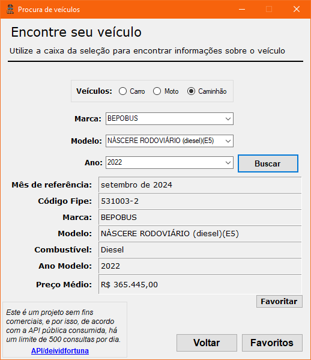
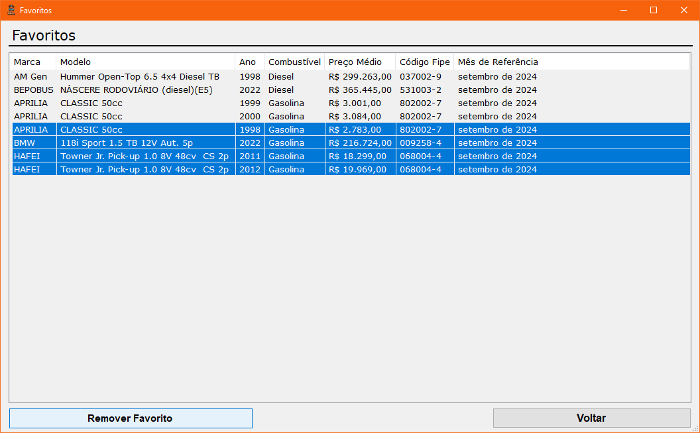

# Consultar Fipe

[Português](./README.md)

- [Consultar Fipe](#consultar-fipe)
  - [Introduction](#introduction)
  - [Features](#features)
  - [Installation](#installation)

## Introduction

This application allows you to query the Tabela Fipe through the  [FIPE API](https://deividfortuna.github.io/fipe/?ref=public_apis) provided by Deivid Fortuna. Users can specifically search for their vehicle, obtain the corresponding information, and choose to favorite the search result.

- This project was developed as part of the [#7DaysOfCode](https://7daysofcode.io/matricula/windows-forms) challenge, which aims to build a desktop application using **Windows Forms** and consuming a Rest API with **C#**.

## Features

**Search:** Through forms, users can specify their vehicle of choice and find updated information.

**Favorites:** Users can choose to favorite or unfavorite a search result. *Note: Favorites will be stored locally on your desktop in a folder named `Favorites`.*

  
  

## Installation

You can find the installer in the [Releases](https://github.com/pluis29/ConsultarFipe/releases/tag/1.0) section of the repository.
