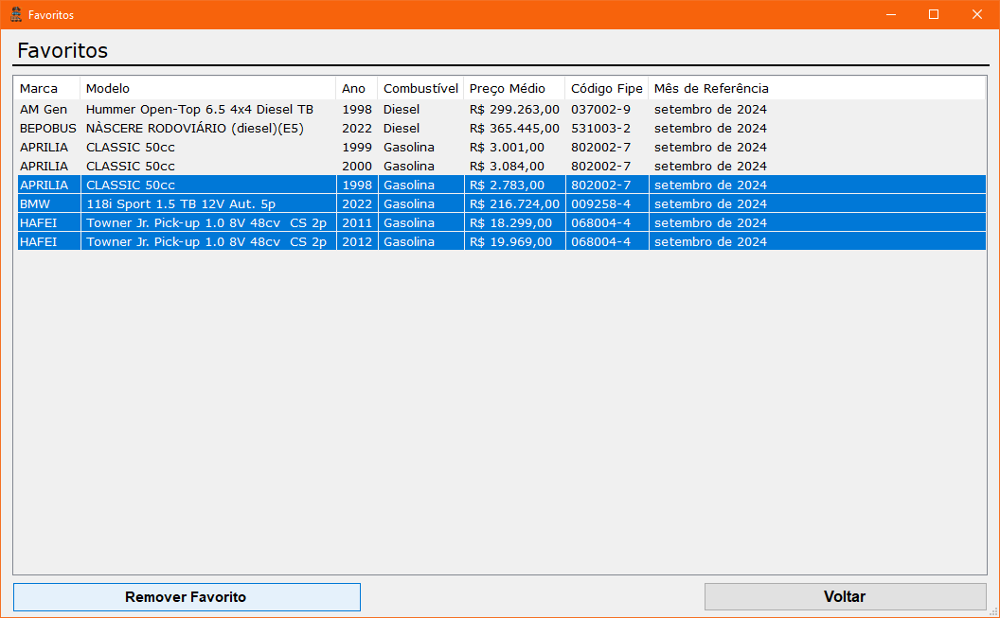

# Consultar Fipe

[English](./EN-README.md)

- [Consultar Fipe](#consultar-fipe)
  - [Introdução](#introdução)
  - [Features](#features)
  - [Instalação](#instalação)

## Introdução

Esta aplicação permite consultar a Tabela Fipe através da [FIPE API](https://deividfortuna.github.io/fipe/?ref=public_apis) fornecida por Deivid Fortuna. O usuário pode procurar especificamente pelo seu veículo, obter as informações correspondentes e, consequentemente, optar por favoritar o resultado da pesquisa.

- Este projeto foi desenvolvido como parte do desafio [#7DaysOfCode](https://7daysofcode.io/matricula/windows-forms), que visa construir uma aplicação desktop utilizando **Windows Forms** e consumindo uma API Rest com **C#**.

## Features

**Pesquisa:** Através de formulários, o usuário pode especificar seu veículo de escolha e encontrar suas informações atualizadas.

**Favoritos:** O usuário pode optar por favoritar ou desfavoritar um resultado de busca. *OBS: Os favoritos serão armazenados localmente na sua área de trabalho com o nome da pasta `Favoritos`.*

  
  

## Instalação

Você pode encontrar o instalador na seção [Releases](https://github.com/pluis29/ConsultarFipe/releases/tag/1.0) do repositório.
